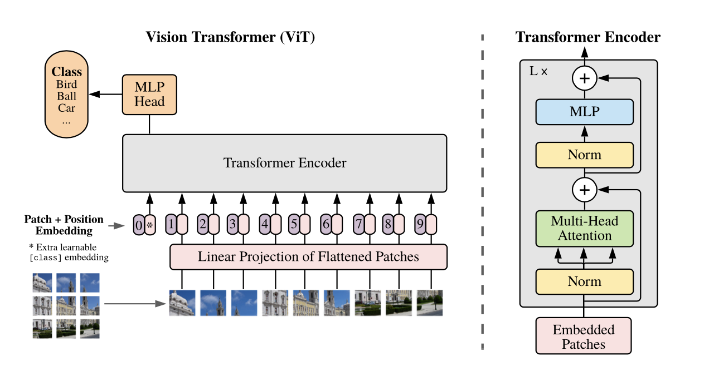

# Vision Transformer Classifier for Food Recognition with Chatbot
  
This repository contains a presentation and code demonstration of Food Recognition using Vision Transformer (ViT) with OpenAI's GPT-3.5 Chatbot.
  
Presenter: Yitian(Ewan) Long
  

  
## Table of Contents
- [Overview](#overview)
    - [Video Recording](#video-recording)
    - [Motivation](#motivation)
    - [Introduction](#introduction)
    - [Characterized Approach](#characterized-approach)
- [Model Card & Dataset Card](#model-card--dataset-card)
    - [Model Card](#model-card)
    - [Dataset Card](#dataset-card)
- [Interactive Demonstration](#interactive-demonstration)
- [Code Demonstration](#code-demonstration)
- [Food Recognition with Chatbot](#food-recognition-with-chatbot)
- [Critical Analysis](#critical-analysis)
    - [The Impact of This Project](#the-impact-of-this-project)
    - [Next Steps](#next-steps)
- [Resources & Citations](#resources--citations)

## Overview
  
### Video Recording
[Overview of Vision Transformer Classifier for Food Recognition with Chatbot](https://youtu.be/kFXhN97R0fk)
  
### Motivation
  
Traditional image recognition models, CNNs (Convolutional Neural Networks), recognize relatively general categories. For example, in the past, Apple's iPhone Photos could accurately identify apples, bananas, steaks, etc., using a CNN model. However, for more specific food categories, such as apple pie, chicken curry, and kung pao chicken, it might not have been able to precisely identify them in the past. 
  
This is mainly because the differences between these food categories are very small, and traditional CNN models struggle to extract effective features for differentiation. In addition, traditional CNN models perform poorly when dealing with long-distance dependencies, makes it more difficult to extract features for these fine-grained food categories.
  
That's why we are introducing the Vision Transformer (ViT) model, which is more suitable for handling long-distance dependencies and extracting global features through self-attention mechanisms. 
  
### Introduction
- Self-attention-based architectures, such as Transformers, have become the model of choice in natural language processing (NLP). However, convolutional nueral networks (CNNs) remain dominant in computer vision tasks (LeCun et al., 1989; Krizhevsky et al., 2012; He et al., 2016).
  
- Google's research team applied a standard Transformer directly to images with the fewest possible modifications. By dividing the image into fixed-size patches and provide the sequence of linear embeddings of these patches as input to a Transformer, images are processed the same way as tokens (words) in an NLP application, and train the model on image classificationin supervised fashion.
  

  
- When trained on large datasets (14M-300M images), they find that large scale training trumps inductive bias. 
  
- The ViT model pre-trained on the public ImageNet-21k dataset, it approaches or surpasses the performance of the art on multiple image recognition benchmarks.
  
### Characterized Approach
- We aim to train the ViT model for food recognition, which can accurately and effectively identify more specific food categories.

- Google's ViT model has been proven to be effective in image recognition tasks, so we fine-tuned the model on a food image classification dataset to achieve high accuracy in this project.

- The food image classification dataset provides a solid foundation for fine-tuning a robust and precise image classification model.
  
## Model Card & Dataset Card
  
### Model Card
- Model Name: Food Type Image Detection Vision Transformer
- Original Model: Vision Transformer (ViT) model pre-trained on ImageNet-21k (14 million images, 21,843 classes) at resolution 224x224. 
    - It was introduced in the paper [An Image is Worth 16x16 Words: Transformers for Image Recognition at Scale](https://arxiv.org/abs/2010.11929) by Dosovitskiy et al. and first released in [this repository](https://github.com/google-research/vision_transformer).
    - Images are presented to the model as a sequence of fixed-size patches (resolution 16x16), which are linearly embedded. 
    - Does not provide any fine-tuned heads, as these were zero'd by Google researchers.
- Model Type: Image Classification
- Model Architecture: Vision Transformer (ViT)
- Fine-tuning: 
    - Fine-tuned on Food Image Classification Dataset by using 12 varieties of these 35 varieties
        - When attempting to use Google Colab Pro to train the entire dataset, the system automatically disconnects from Google's servers about five hours into the training, resulting in the loss of the uploaded dataset, all data trained so far, and all installed packages.
    - Optimizer: AdamW
    - Epochs: 20
- Model Performance: Achieved an accuracy of 96.23% on all of the kinds of Food Image Classification Dataset
  
### Dataset Card
- Dataset Name: 'Food Image Classification Dataset'
- Dataset Size: 24K unique images
- Dataset Description: 35 varieties of both Indian and Western appetizers
- Dataset Source: The unique images obtained from various Google resources by Kaggle user Harish Kumar
- Dataset License: CC0: Public Domain
- Dataset Quality: 
    - Meticulously curated images ensuring diversity and representativeness
    - Provides a solid foundation for developing robust and precise image classification algorithms
    - Encourages exploration in the fascinating field of food image classification）
- Expected Update Frequency: Quarterly
  
## Interactive Demonstration
You can interact with the model through out Hugging Face Spaces platform. The intuitive interactive demonstration allows you to upload an image of food or use the examples and then get the model's prediction of the food category.
  
[Food Recognition Demonstration](https://huggingface.co/spaces/ewanlong/Food_Recognition)
  
## Code Demonstration
  
[Food Recognition Code Demonstration](https://colab.research.google.com/drive/1UFw55qTsWHvw4_VfOVDWPboAi_tFdpjV#scrollTo=lTPI4fLv7vgH)

## Food Recognition with Chatbot
Here, we've built a chatbot, which makes the project not only can perform food classification based on Vision Transformer but also incorporates OpenAI's API to facilitate real-time interactive dialogues. You can ask anything you wish to know more about the food you've uploaded, easily obtain the ingredients and methods needed to make it, and even recreate this delicious meal in your own kitchen tonight.
  
[Food Recognition with Chatbot](https://huggingface.co/spaces/ewanlong/Food_Recognition_with_Chatbot)
  
## Critical Analysis
  
### The Impact of This Project
  
- It can accurately identify more specific food categories than traditional CNN models.
  
- It can accurately identify food under different environments and lighting conditions. For example, it can also achieve high accurate recognition in dim light environments and complex scenes.
  
- As we used an open-source model, it's possible to retrain the model to recognize specific traditional and specialty cuisines, such as Scottish traditional food Haggis or Beijing roast duck.

- The Food Recognition with Chatbot Version can easily interact with OpenAI's ChatGPT to get more information about the food, such as its history, ingredients, and recipes.
  
### Next Steps

- Extending the model to recognize more categories of food, such as desserts, main courses, and beverages.
  
- Extending it to recognize more categories, not just types of food, but also types of plants, animals, and so on, making its functionality more diverse.
  
- Encapsulating the model into a smaller model and run it locally. 
   
- Trying multimodal recognition by combining the model with other models, such as image generation models, to generate images of food based on the your text description.
  
- Combining it with other vision transformer models (Swin) and also CNNs, to improve the accuracy and efficiency of recognition.
  
## Resources & Citations
- [Dosovitskiy, A., Beyer, L., Kolesnikov, A., Weissenborn, D., Zhai, X., Unterthiner, T., ... & Houlsby, N. (2020). An image is worth 16x16 words: Transformers for image recognition at scale. arXiv preprint arXiv:2010.11929.](https://arxiv.org/abs/2010.11929)
- [Liu, Z., Lin, Y., Cao, Y., Hu, H., Wei, Y., Zhang, Z., ... & Guo, B. (2021). Swin transformer: Hierarchical vision transformer using shifted windows. In Proceedings of the IEEE/CVF international conference on computer vision (pp. 10012-10022).](https://arxiv.org/abs/2103.14030)
- [Google Research Vision Transformer](https://github.com/google-research/vision_transformer)
- [Google ViT Model Pre-trained on ImageNet-21k](https://huggingface.co/google/vit-base-patch16-224-in21k)
- [Food Image Classification Dataset](https://www.kaggle.com/datasets/harishkumardatalab/food-image-classification-dataset/data)
- [Fine-Tune ViT for Image Classification with 🤗 Transformers](https://huggingface.co/blog/fine-tune-vit)
- [Food Recognition Benchmark Starter Kit](https://github.com/AIcrowd/food-recognition-benchmark-starter-kit)
  
  
  

